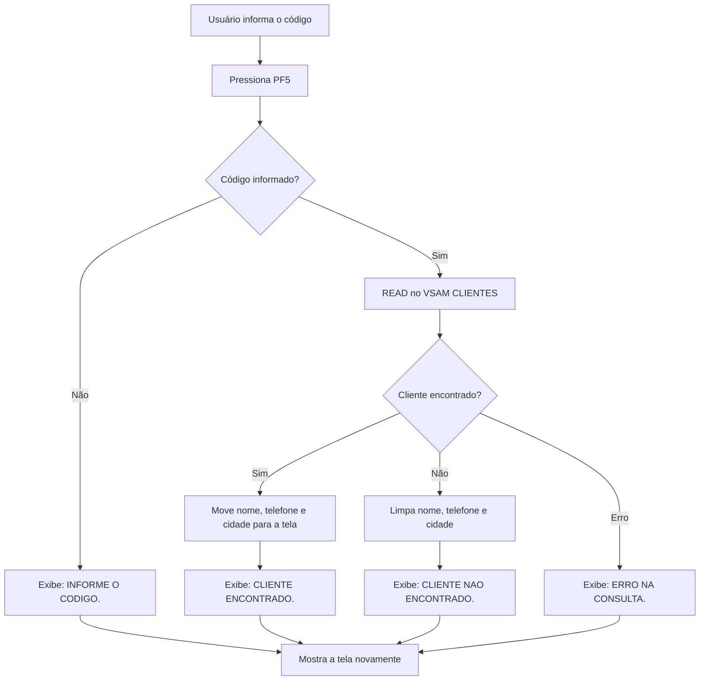
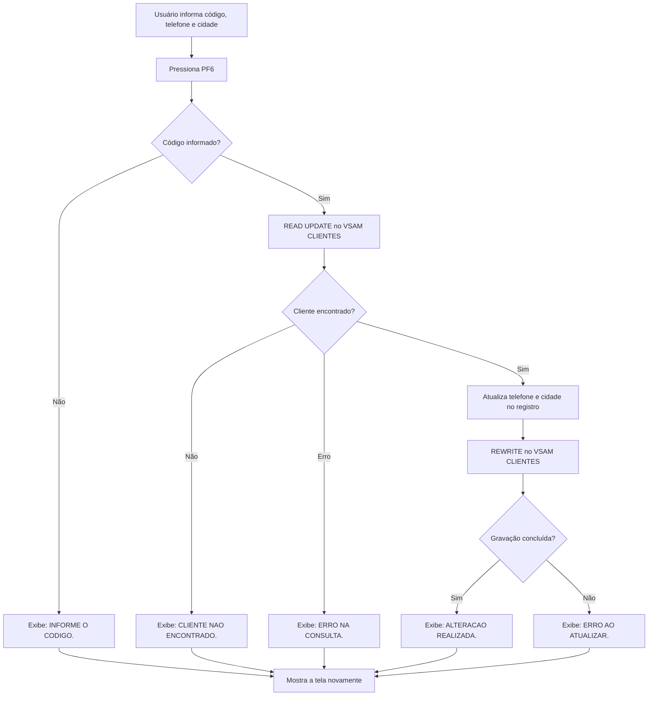

# Projeto Consulta e Atualização de Clientes em CICS

Projeto desenvolvido em COBOL no ambiente **TK5/MVS 3.8j**, utilizando **TN3270** e **KICKS** para simular ambiente CICS.

O sistema implementa uma aplicação online para consulta e atualização de clientes armazenados em um arquivo VSAM. A transação `CLIE` executa o programa `PROJETO7`, que interage com uma tela BMS e com o arquivo `CLIENTES`.

---

## Lógica de Funcionamento

Ao executar a transação `CLIE`, o sistema apresenta a tela de consulta de clientes.

O usuário informa o código do cliente e utiliza as teclas de função para consultar, alterar ou sair da transação.

* **PF5** consulta o cliente pelo código informado.
* **PF6** atualiza somente telefone e cidade.
* **PF3** encerra a transação e retorna ao terminal do KICKS.


---

## Em Funcionamento no TK5 com o KICKS com testes das funcionalidades


---

## Fluxograma PF5 - Consulta



---

## Fluxograma PF6 - Atualização



---

## Arquivos do Projeto

```text
PROJETO7.cbl        Programa COBOL executado pela transação CLIE
MAPSP7.bms          Fonte do mapa BMS da tela
VSAMP7.jcl          JCL para criar e carregar o arquivo VSAM CLIENTES
MAPP7.jcl           JCL para gerar o mapa BMS
BUILDP7.jcl         JCL para compilar e linkar o programa COBOL
```

---


## Tela do Sistema


---

### Configuração de apoio usada no KICKS

Para a aplicação funcionar no ambiente KICKS, foram necessarias mais alguns arquivos configurados :

```text
PCT  -> A transação CLIE apontando para o programa PROJETO7
PPT  -> Programa PROJETO7 e mapset MAPSP7
FCT  -> Arquivo VSAM CLIENTES
```

Essas configurações foram usadas apenas para permitir a execução no KICKS.

---

## Comandos CICS/KICKS Utilizados

```text
SEND      Envia a tela BMS para o terminal
RECEIVE   Recebe os campos preenchidos pelo usuário
RETURN    Encerra a transação
READ      Consulta o cliente no VSAM
REWRITE   Atualiza o registro no VSAM
```

---

## Objetivo do Projeto

Este projeto tem como objetivo praticar desenvolvimento COBOL online em ambiente mainframe, utilizando transações CICS/KICKS, mapa BMS, interação com terminal 3270, consulta e atualização de registros VSAM. E a aplicação foi executada com sucesso no ambiente TK5/KICKS, permitindo consultar clientes e persistir alterações de telefone e cidade.
::: 
